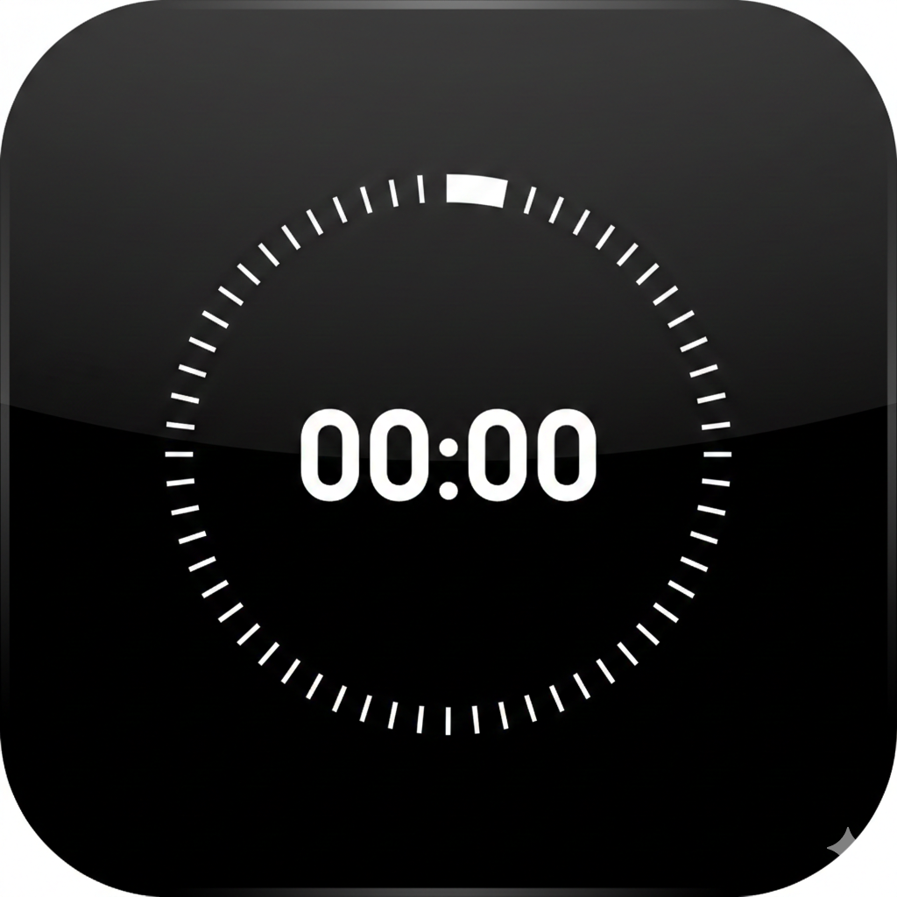

<p align="center">
  
</p>

<h1 align="center">SimpleTimer</h1>

<p align="center">Minimale Timer-App für iOS mit drei konfigurierbaren Timern.</p>

---

## Features

- **3 Timer** — jeweils als Countdown oder Stoppuhr nutzbar
- **Wheel-Picker** — Minuten und Sekunden bequem per Drehrad einstellen
- **Wählbarer Alarm-Sound** — 16 iOS-System-Sounds zur Auswahl pro Timer
- **Endlosschleife** — Timer startet nach Ablauf automatisch neu
- **Protokoll** — loggt abgelaufene Timer und zurückgesetzte Stoppuhren mit Zeitstempel und Gesamtzeit
- **Darstellung** — System, Hell oder Dunkel

## Bedienung

| Aktion | Geste |
|---|---|
| Timer starten/stoppen | Auf die Zeit tippen |
| Timer zurücksetzen | Pfeil-Button rechts |
| Einstellungen | Zahnrad oben rechts |
| Protokoll | Listen-Icon oben links |

## Anforderungen

- iOS 17.0+
- Xcode 15+

## Installation

```bash
git clone https://github.com/thomhug/SimpleTimer.git
cd SimpleTimer
open SimpleTimer.xcodeproj
```

Auf dem Gerät oder Simulator bauen und starten.
